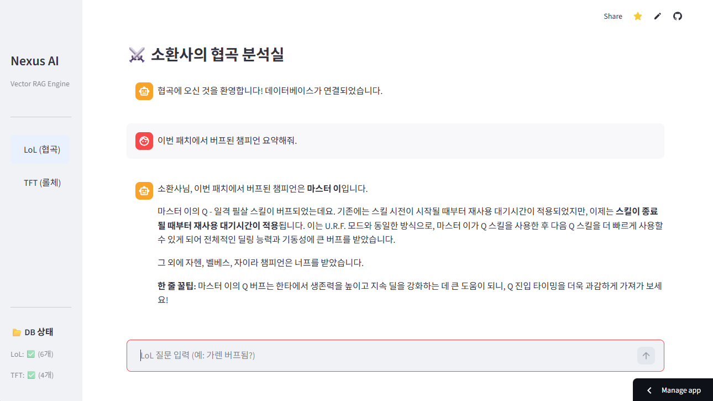
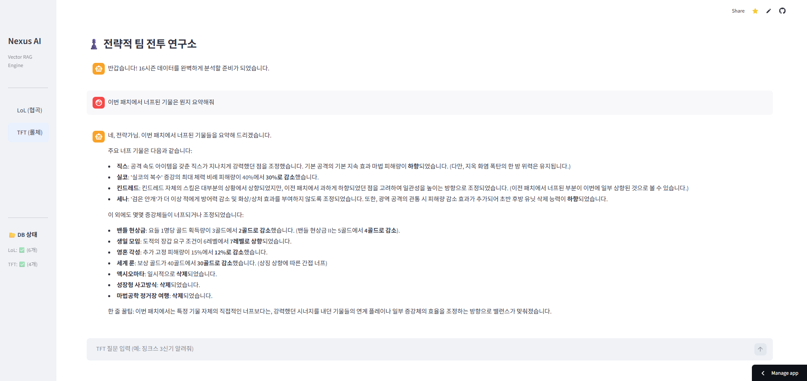

# 🎮 Nexus AI : LoL & TFT Analysis Assistant

[](https://nexus-app.streamlit.app/)


> **"소환사님, 이번 패치 꿀덱은 데이터가 증명합니다."** > Nexus AI는 **RAG(검색 증강 생성)** 기술을 활용하여, 최신 롤/TFT 패치 데이터를 학습하고 분석해주는 AI 어시스턴트입니다.

<br>

## 📸 Screenshots

| **메인 화면 (LoL 모드)** | **전략적 팀 전투 (TFT 모드)** |
|:-----------------------:|:---------------------------:|
|  |  |
| *깔끔한 Gemini 스타일 UI와 LoL 분석* | *TFT 시즌 16 데이터 기반 덱 추천* |

<br>

## ✨ Key Features (주요 기능)

* **🕹️ 듀얼 게임 모드 지원**
    * **LoL (소환사의 협곡):** 챔피언 정보, 아이템 빌드, 룬 추천
    * **TFT (전략적 팀 전투):** 최신 시즌(Set 16) 기물 정보, 추천 메타 덱, 증강체 분석
    * Gemini 스타일의 직관적인 사이드바 UI로 모드 간 즉시 전환 가능

* **🧠 RAG (Retrieval-Augmented Generation) 엔진**
    * 단순한 GPT/Gemini가 아닙니다. `CommunityDragon` 등에서 추출한 **실시간 최신 패치 데이터**를 Vector DB(FAISS)에 저장합니다.
    * AI가 "환각" 없이 팩트에 기반한 답변을 제공합니다.

* **💬 게이머 페르소나 (Gamer Persona)**
    * 딱딱한 로봇 말투가 아닌, 실제 게이머가 쓰는 용어 사용
    * *"너프, 버프, 3신기, 순방, 억까"* 등 자연스러운 대화 가능

* **⚡ 고성능 AI 모델**
    * **LLM:** Google `gemini-2.5-flash` (빠르고 정확함)
    * **Vector DB:** `FAISS` (대용량 텍스트 초고속 검색)

<br>

## 🛠️ Tech Stack (기술 스택)

* **Frontend:** Streamlit (Custom CSS for Gemini-like UI)
* **LLM Framework:** LangChain (Python)
* **Model:** Google Gemini 2.5 Flash
* **Database:** FAISS (Local Vector Store)
* **Data Source:** Riot CommunityDragon API, Riot Official Patch Note (Raw Data Processing)

<br>

## 🚀 Getting Started (설치 및 실행)

이 프로젝트를 로컬 환경에서 실행하려면 다음 단계가 필요합니다.

### 1. Prerequisites (필수 조건)
* Python 3.9 이상
* Google AI Studio API Key ([발급받기](https://aistudio.google.com/))

### 2. Clone Repo
```bash
git clone https://github.com/Youl-AI/Nexus-AI.git
cd Nexus-AI
```

### 3. Install Dependencies
```bash
pip install -r requirements.txt
```

### 4. Set API Key
프로젝트 루트에 `.streamlit/secrets.toml` 파일을 생성하고 키를 입력합니다.  
(⚠️ 주의: 이 파일은 절대 깃헙에 올리지 마세요!)

**`.streamlit/secrets.toml`**
```toml
GOOGLE_API_KEY = "여기에_발급받은_키_입력"
```

### 5. Fetch Data (데이터 최신화)
최신 게임 데이터를 받아와서 텍스트 파일로 저장합니다.
```bash
python patch_crawler.py  # TFT 데이터 추출
```

### 6. Run App
```bash
streamlit run nexus_app.py
```

<br>

## 📂 Project Structure

```bash
Nexus-AI/
├── data/                  # 수집된 Raw 텍스트 데이터 (.txt)
├── .streamlit/
│   └── secrets.toml       # API 키 저장소 (Git 제외)
├── assets/                # README용 이미지 폴더
├── nexus_app.py           # 메인 애플리케이션 코드 (Streamlit)
├── patch_crawler.py       # 패치 데이터 추출 스크립트
├── requirements.txt       # 패키지 목록
└── README.md              # 프로젝트 설명서
```

<br>

## 🔮 Future Roadmap

- [ ] **이미지 분석 기능 (Vision):** 인게임 스크린샷을 분석하여 실시간 덱 추천
- [ ] **자동 데이터 갱신:** 버튼 클릭 한 번으로 최신 패치 데이터 동기화
- [ ] **전적 검색 연동:** 소환사 이름을 입력하면 최근 전적 분석

<br>

---
**License** This project is licensed under the MIT License.

**Contact** Created by **[김하율/Youl-AI]** - Feel free to contact me!
